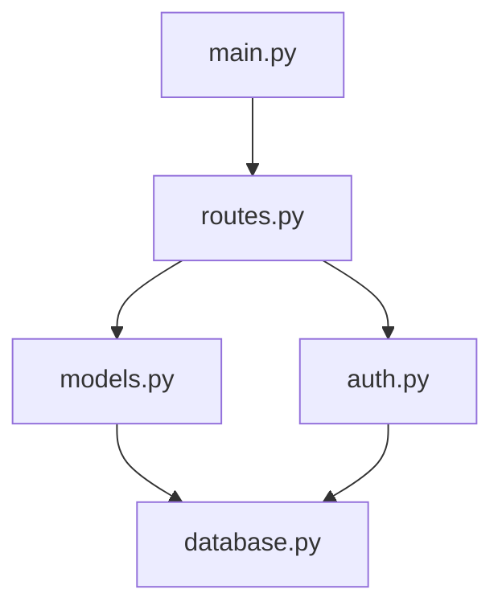

오늘은 Claude Code를 사용하면서 프로젝트별로 CLAUDE.md 파일을 만들어 AI 어시스턴트의 효율성을 높이는 방법에 대해 이야기해보려고 한다.

에이전틱 코딩에서 좋은 결과를 내기 위해서는???
-> 컨텍스트 윈도우를 어떻게 적절히 나누고 설계해 지시하느냐가 매우 중요함.
어떻게 적절히 나누고
어떻게 적절히 설계하고
어떻게 적저맇 지시하는가

에이전틱 코딩의 핵심은 컨테스트 엔지니어링 이다.


핵심???
- 
- 컨텍스트 우선순위 명시
- 원칙 작성시 실제 코드 예시 중심의 명시
- 점진적 코드 마이그레이션에 대한 가이드 명시


점진적 코드 마이그레이션 가이드
## Refactoring Guidelines

### 기존 코드 수정 시
1. 해당 파일만 새 패턴으로 업데이트
2. 관련 테스트 함께 업데이트
3. 주변 코드는 건드리지 않음

### 새 기능 추가 시
1. 항상 최신 패턴 사용
2. 기존 코드와 인터페이스만 맞춤
   


## CLAUDE.md란?

CLAUDE.md는 Claude Code가 프로젝트를 더 잘 이해하고 효율적으로 작업할 수 있도록 돕는 가이드 문서다. 

## 왜 필요한가?

매번 Claude에게 프로젝트 구조를 설명하거나 빌드 명령어를 알려주는 것은 비효율적이다. CLAUDE.md 파일을 만들어두면:

- 프로젝트의 핵심 구조를 한 번에 파악
- 자주 사용하는 명령어를 즉시 실행
- 프로젝트별 컨벤션 준수
- 반복적인 설명 없이 바로 작업 시작
- 프로젝트 수행 일관성 유지

## 무엇을 포함해야 하나?

### 1. 필수 명령어
```bash
# 개발 서버 실행
npm run dev

# 테스트 실행
npm test

# 빌드
npm run build
```

### 2. 프로젝트 아키텍처
- 핵심 디렉토리 구조
- 주요 컴포넌트간 관계
- 데이터 흐름 -> mermaid 로 작성

### 3. 코딩 컨벤션
- 네이밍 규칙
- 파일 구조 패턴
- 사용하는 라이브러리

## 실제 적용 사례

jekyll 를 통한 블로그 발행에 claude 를 사용하는 것은 토큰 낭비일 수 있지만, 효과적인 테스트를 위해 수행해본다.

버저닝 관리
1. semantic versioning 적용
<!-- claude.md -->
---
version: 2.1.0
last_updated: 2025-01-15
changelog: ./docs/claude-changelog.md
---

# Claude Configuration v2.1.0
버전 규칙:
- Major (X.0.0): 근본적인 개발 철학이나 아키텍처 변경
- Minor (0.X.0): 새로운 코딩 규칙, 도구 추가
- Patch (0.0.X): 오타 수정, 예시 코드 개선

2. 버전 이력 관리 (changelog)
<!-- docs/claude-changelog.md -->
# Claude Configuration Changelog

## [2.1.0] - 2025-01-15
### Added
- TypeScript strict mode 규칙 추가
- React Server Components 패턴 가이드

### Changed
- API 에러 핸들링 패턴 업데이트
- 테스트 커버리지 목표 80% → 85%

### Deprecated
- Class 컴포넌트 패턴 (v3.0.0에서 제거 예정)

## [2.0.0] - 2024-12-01
### Breaking Changes
- 상태관리 Redux → Zustand 마이그레이션
- 폴더 구조 전면 개편
claudecode-config 폴더를 만들고, 버전별로 md 파일을 관리한다.
project/
├── claude.md              # 현재 활성 버전
├── claude-configs/
│   ├── v1-mvp.md         # MVP 단계 설정
│   ├── v2-scaling.md     # 스케일링 단계
│   └── v3-enterprise.md  # 엔터프라이즈 단계
팀단위로 claude.md 를 관리할떄는 이것을 공유함으로서 모두가 동일한 코딩스타일을 코드 생성이 가능하도록 한다.
1. 버전번호 업데이트
2. changelog 작성
3. breaking chages 명시
4. 팀원 리뷰 요청
5. 예시 코드 테스트 완료
6. 관련 문서 업데이트 지시


환경단위로 설정을 나누기
### dev
- 상세한 로깅 포함
- 모든 경고 표시
- hot reload 최적화
### prod
- 최소한의 로깅
- 에러만 리포팅
- 번들 사이즈 최적화
-> CLAUDE_ENV=development # or production, staging


## 마무리

AI 코딩 어시스턴트의 시대에 CLAUDE.md 같은 프로젝트 가이드 문서는 선택이 아닌 필수가 되어가고 있다. 작은 투자로 큰 효율성을 얻을 수 있는 방법이다.

여러분의 프로젝트에도 한 번 적용해보는 것은 어떨까?

---

Claude Code(Anthropic의 터미널 기반 코딩 에이전트)가 맥락 손실 문제를 해결하기 위해 사용하는 전략은???

## Claude Code의 맥락 유지 전략

### 1. **파일 시스템 전체 이해**
```bash
# Claude Code는 프로젝트 구조를 먼저 파악
tree -L 3
find . -type f -name "*.py" | head -20
ls -la
```
- 프로젝트 전체 구조를 메모리에 유지
- 파일 간 의존성 관계 파악
- 관련 파일들을 그룹으로 인식

### 2. **작업 컨텍스트 누적**
```python
# 예: 이전 작업 내용을 참조하며 진행
"""
이전에 수정한 내용:
1. database.py에서 연결 풀 설정
2. models.py에서 User 모델 정의
3. 현재 작업: routes.py에서 위 두 파일 활용
"""
```

### 3. **명시적 상태 추적**
```bash
# Claude Code는 작업 상태를 명시적으로 기록
echo "✓ Step 1: Database configuration completed"
echo "✓ Step 2: Models created"
echo "→ Step 3: Working on API routes"
```

### 4. **청크 간 참조 유지**
```python
# 파일 A (models.py)
class User:
    """사용자 모델 - routes.py에서 사용됨"""
    pass

# 파일 B (routes.py)  
# Claude Code는 User 모델의 구조를 기억하고 있음
from models import User  # 이전 컨텍스트 참조
```

### 5. **의도와 목표 보존**
```bash
# 작업 시작 시 목표 명시
cat << EOF > .claude-context
PROJECT_GOAL: RESTful API 서버 구축
CURRENT_TASK: 사용자 인증 시스템 구현
COMPLETED: [Database, Models]
TODO: [Routes, Middleware, Tests]
EOF
```

## 실제 작동 방식 예측

### 1. **컨텍스트 윈도우 최적화**
```python
# Claude Code가 취할 것으로 예상되는 접근
class ContextManager:
    def __init__(self):
        self.project_summary = self.scan_project()
        self.recent_changes = []
        self.file_relationships = self.analyze_imports()
    
    def add_context(self, file_path, changes):
        """변경사항을 컨텍스트에 추가"""
        self.recent_changes.append({
            'file': file_path,
            'changes': changes,
            'timestamp': datetime.now(),
            'related_files': self.get_related_files(file_path)
        })
```

### 2. **심볼 테이블 유지**
```python
# 프로젝트 전체의 함수, 클래스, 변수 추적
symbol_table = {
    'functions': {
        'auth.py': ['login', 'logout', 'verify_token'],
        'database.py': ['connect', 'disconnect', 'execute_query']
    },
    'classes': {
        'models.py': ['User', 'Post', 'Comment']
    },
    'dependencies': {
        'routes.py': ['models.py', 'auth.py', 'database.py']
    }
}
```

### 3. **작업 히스토리 보존**
```bash
# .claude-history 파일에 작업 기록
echo "[$(date)] Modified authentication logic in auth.py" >> .claude-history
echo "[$(date)] Added password hashing using bcrypt" >> .claude-history
echo "[$(date)] Updated User model with new fields" >> .claude-history
```

### 4. **코드 주석으로 컨텍스트 임베딩**
```python
def process_payment(order_id):
    """
    결제 처리 함수
    
    Context:
    - Called from: checkout_route() in routes/checkout.py
    - Depends on: PaymentGateway class in services/payment.py
    - Updates: Order status in database
    - Related tickets: #123, #456
    """
    # 이전 단계에서 검증된 order_id 사용
    # (validation은 checkout_route에서 완료)
    pass
```

### 5. **테스트 기반 컨텍스트 검증**
```python
# 테스트를 통해 컨텍스트 일관성 확인
def test_full_workflow():
    """전체 워크플로우 테스트로 컨텍스트 검증"""
    # Step 1: 이전 작업 결과 확인
    assert database_connected()
    
    # Step 2: 현재 작업 검증
    user = User.create(...)
    assert user.id is not None
    
    # Step 3: 다음 작업 준비
    assert can_create_session(user)
```

## Claude Code만의 특별한 전략 (추정)

### 1. **대화형 확인 메커니즘**
```bash
# 중요한 컨텍스트 변경 시 확인
echo "About to modify the authentication flow."
echo "This will affect: login(), logout(), middleware"
read -p "Continue? (y/n): " confirm
```

### 2. **컨텍스트 요약 생성**
```markdown
## Current Context Summary
- Working on: E-commerce backend
- Recently modified: 5 files
- Current focus: Payment integration
- Dependencies to consider: User model, Order model, PaymentGateway
- Potential impacts: Frontend API contracts
```

### 3. **자동 문서화**
```python
# 변경사항을 자동으로 문서화
"""
CHANGELOG:
- 2024-01-15: Added user authentication
- 2024-01-15: Implemented password hashing
- 2024-01-15: Created JWT token generation
- Current: Working on role-based access control
"""
```

### 4. **의존성 그래프 유지**


### 5. **점진적 개발 접근**
```bash
# 작은 단위로 나누어 컨텍스트 손실 최소화
git add -p  # 부분적 커밋
git commit -m "feat: Add user model"
git commit -m "feat: Add authentication"
git commit -m "feat: Connect auth to routes"
```

## 핵심 원칙

1. **명시적 > 암시적**: 모든 컨텍스트를 명시적으로 기록
2. **연속성 유지**: 작업 간 연결고리를 명확히
3. **검증 가능성**: 테스트로 컨텍스트 일관성 확인
4. **문서화**: 변경사항과 이유를 항상 기록
5. **점진적 진행**: 큰 변경을 작은 단위로 분할

이러한 전략들을 통해 Claude Code는 긴 코딩 세션에서도 프로젝트의 전체적인 맥락을 잃지 않고 일관성 있는 코드를 생성할 수 있을 것으로 예상됩니다.